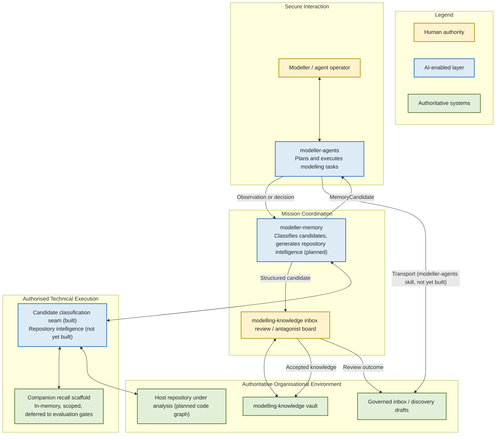

# Modeller Memory Vision

## Generated, non-authoritative intelligence for the Aimsun agent ecosystem

**Status:** Draft strategic reflection and discussion document
**Version:** 0.1, 25 July 2026
**Audience:** Maintainers of modeller-memory, modeller-agents, and modelling-knowledge; anyone deciding whether to continue funding the repository-intelligence and companion-recall build-out
**Purpose:** Give an honest, current account of what modeller-memory is for and how far it has actually got, to support a decision on whether and how to continue building it
**Upstream document:** modelling-ecosystem/.docs/architecture.md (§1 diagram, MEM subgraph); docs/INTEGRATION_PLAN.md's revised product statement
**Downstream document:** None yet. A business-need-and-design brief for the repository-intelligence (GRAPH) build-out would be the natural next document, once a direction is chosen

---

## 1. Executive Summary

The Aimsun agent ecosystem already has two things this repository exists to connect: a governed knowledge vault (modelling-knowledge) that holds accepted, human-reviewed organisational knowledge, and an agent framework (modeller-agents) that does the day-to-day work of planning and executing modelling tasks. What neither of those repositories does on its own is generate fast, disposable intelligence about the state of a working repository, or turn an agent's in-flight observation into something a human reviewer can safely consider for the vault.

modeller-memory exists to fill that gap, as a generated, non-authoritative layer, explicitly not a second source of truth. Today it is emerging, not operational: one of its two declared capabilities, candidate classification, is built and tested; the other, repository intelligence, has no implementation on disk at all; a third, scoped companion recall, exists only as an in-memory scaffold deliberately gated behind evaluation criteria that have not yet been run. This document should be read as a description of an emerging capability with a real but partial foundation, not as a record of an operating system.

The central idea has held up under scrutiny: memory should never become a second, quieter authority sitting beside the vault it is meant to feed. Every architectural correction this repository has already made, recorded in its own ADRs, was a correction back toward that idea after an earlier draft drifted from it.

What the reader is being asked to consider is not a commitment to a roadmap already decided. It is whether the remaining, unbuilt half of this design, principally repository intelligence and the authority-context validator that the classification seam depends on, is worth continuing to build, and at what pace.

> **Memory should extend what the organisation already knows, never quietly become a second, unreviewed version of it.**

---

## 2. Strategic Opportunity

modelling-knowledge already holds the organisation's accepted knowledge, governed by explicit metadata, controlled vocabulary, and a link graph that vault_doctor validates on every change. modeller-agents already does the orchestration work of turning a modelling objective into authorised, executed tasks. Both of these are real, working foundations; neither needed to be rebuilt to create modeller-memory.

The remaining opportunity is to connect this foundation more effectively with:

- fast, structural awareness of a working repository's actual state (freshness, code-graph relationships), so an agent's plan is grounded in what is really there rather than what a stale document says was there;
- a disciplined seam for turning an agent's in-flight observation or decision into something a human reviewer can consider for the vault, instead of either discarding it or writing it in directly;
- continuity of working context within a session or project, scoped tightly enough that it never leaks across clients or projects, so an agent does not have to rebuild context from nothing every time.

Today, an agent's observations either evaporate at the end of a session or get written informally wherever is convenient, with no consistent seam into governed review. This can mean a useful observation is lost, or, worse, that an unreviewed claim quietly starts being treated as if it were accepted knowledge.

> Fragmentation risks (concrete, recurring failure modes already surfaced by this repository's own design history):
> - an agent's classification of a candidate observation is resolved against a stale or incomplete authority context, because no validator yet confirms that context is current before a conflict decision is made;
> - a memory-generated claim drifts into being treated as accepted knowledge because the write path from candidate to vault is not kept visibly separate from the vault's own governed inbox;
> - two repositories claim ownership of the same operational skill, producing contradictory instructions for anyone trying to invoke it;
> - a companion-recall store, if built carelessly, could silently surface one project's or one client's context inside another's session.

These matter because the value of this connecting layer is not primarily speed: it is keeping a hard, visible line between what an agent has merely observed and what the organisation has actually decided to accept.

---

## 3. Vision Statement

> **Working repository state and in-flight agent observations should be available fast and cheaply, without ever being mistaken for, or silently promoted into, the organisation's accepted knowledge.**

This vision does not require modeller-memory to read or write the vault directly, and it deliberately does not: the vault stays reachable only through modelling-knowledge's own governed inbox, reviewed by a human or an antagonist board. Nor does it require a single, global memory store; scoped isolation between clients and projects is a design commitment, not an implementation detail to be added later.

The target experience, for an agent working inside modeller-agents: rather than assuming a repository's structure and freshness from a document that may be out of date, or silently accumulating undocumented observations that never reach review, the agent would query modeller-memory for a fast evidence packet about the repository's current state, submit a structured observation for classification, and receive back a typed candidate it can hand onward to modeller-agents' own transport skill for governed review. Nothing the agent does through this seam writes to the vault directly.

| Today | With modeller-memory (as designed, partly built) |
|---|---|
| An agent's plan is grounded in whatever document was last read, possibly stale | A fast evidence packet or an explicit degraded status reflects the repository's current, structural state |
| An in-flight observation is either lost or written informally with no consistent review seam | The observation is classified into a typed candidate with an authority context, and handed to a governed transport step |
| Skill ownership for memory-related operations was claimed by two repositories at once | Skills live solely in modeller-agents; this repository owns only the API and contracts they call |
| A companion-recall store was drafted as global by default | Companion recall is explicitly scoped per session and project, with no cross-scope retrieval permitted |
| Conflict detection against the vault was specified as if memory could read the vault directly, an impossible operation | Conflicts are resolved only against an orchestrator-supplied authority context, never an independent vault read |

---

## 4. How Modeller Memory Supports the Organisation

modeller-memory is a connecting and generating layer behind modeller-agents, not an independent decision-maker and not a second source of truth; nothing it produces becomes organisational knowledge without passing through modelling-knowledge's own governed review.

### 4.1 Clarify the Objective
Before an agent commits to a plan, it can ask modeller-memory what is actually true about a repository's current structure and freshness, so the objective is framed against real, current state rather than an assumption carried over from the last time someone looked.

### 4.2 Structure the Work
A structured observation or decision submitted for classification is typed against a MemoryCandidate model with an explicit authority context, so what would otherwise be an informal note becomes a reviewable object with a defined shape before any further step is taken.

### 4.3 Connect Existing Capabilities
The classification seam is, today, the only proven runtime touchpoint between modeller-memory and modeller-agents; it exists precisely to connect the agent framework's working output to modelling-knowledge's governed inbox, without either repository absorbing the other's role. Repository intelligence is designed to connect an agent's plan to the actual state of the codebase it is working on, once built.

### 4.4 Support Authorised Execution
The event ledger behind candidate classification is digest-chained, so what was classified, when, and against what authority context stays evidenced and auditable, visible to whoever later needs to check how a candidate reached the state it did.

### 4.5 Assist Analysis
A classified candidate carries a confidence and a destination alongside the observation itself, so the distinction between what was observed and what was concluded about it stays visible; modeller-memory proposes a classification, it does not decide that the observation is correct or should be accepted.

### 4.6 Prepare Decision Evidence
A candidate handed onward through modeller-agents' transport step carries its authority context and evidence with it into modelling-knowledge's inbox, so the human or antagonist reviewer who ultimately decides has the full trail behind the candidate, not just its conclusion.

### 4.7 Preserve Validated Learning
Nothing modeller-memory generates becomes accepted knowledge on its own. A candidate becomes organisational knowledge only after it has passed through modelling-knowledge's own inbox review; this repository's role stops at producing a well-formed, evidenced candidate.

---

## 5. Human-Led Principles and Authority Boundaries

No amount of fast, generated intelligence replaces the contextual judgement of the people and boards who decide what the organisation actually knows. modeller-memory's role is to extend an agent's reach into repository state and to make its observations reviewable, not to substitute for the review itself.

Human and repository authority remains explicit:

- modelling-knowledge's inbox reviewers and antagonist boards confirm whether a classified candidate becomes accepted knowledge;
- modeller-agents owns the skills that transport a candidate from classification into governed review, and the orchestration decisions that surround it;
- modelling-knowledge alone owns read and write access to the vault; modeller-memory has no vault read or write path at all, by explicit architectural decision (ADR-0004);
- only knowledge that has passed modelling-knowledge's own review becomes accepted organisational knowledge; a MemoryCandidate is never treated as accepted on its own.

A few commitments hold throughout:

- the system prepares and classifies; people and governed boards decide;
- a candidate's target destination and confidence are visible and distinct from the observation itself, and both stay distinct from a human's eventual acceptance or rejection of it;
- companion recall, where it exists, stays scoped to the session or project it was created in; nothing in the design permits retrieval across an unrelated scope;
- the system never becomes a silent second authority: modelling-knowledge remains the sole authority over accepted knowledge, and every candidate stays attributable to the observation and authority context that produced it.

The design commits to failing safely, though this specific mechanism is not yet independently proven in production: candidate classification is designed to depend only on an orchestrator-supplied authority context rather than an independent read of the vault, so a missing or unavailable vault connection does not silently corrupt a classification decision. Repository intelligence, being unbuilt, currently fails safe by simply not existing; an agent that cannot reach it falls back to its own direct reading of the repository.

The operating model is federated by design. This repository's own decision record shows it correcting itself away from centralising authority it should not hold: skill ownership was moved wholly into modeller-agents after two repositories briefly claimed it at once, and a proposed global-by-default companion store was rejected before any code was written, in favour of explicit, scoped isolation. modeller-memory coordinates the generation of candidate intelligence; it does not absorb modelling-knowledge's authority over accepted knowledge or modeller-agents' authority over orchestration.

> **modeller-memory generates candidate intelligence; modelling-knowledge retains sole authority over what becomes accepted knowledge.**

### Operating Model (as currently designed)

---

## 6. Secure Foundation Principles

The design keeps modeller-memory mechanically isolated from the parts of the vault it must never touch, and keeps its two workloads, the mature vault_doctor tool and the emerging memory runtime, from becoming dependent on one another.

The governing model, as currently implemented or committed to:

- vault_doctor and the memory runtime are kept apart by an import-guard test that fails the build if either imports the other, so co-location in one repository does not become an accidental coupling;
- the memory runtime has no vault read or write path at all; it depends only on an orchestrator-supplied authority context, never an independent read of modelling-knowledge;
- companion recall, where implemented, stays scoped to the session or project that created it, with no design path to cross-scope or cross-client retrieval;
- promotion of a candidate into the vault stays gated behind modelling-knowledge's own governed inbox and decision 0007's standing conditions, not something modeller-memory can trigger on its own.

Supply-chain choices for the planned repository-intelligence backend, pinning and hash verification for an external code-graph service, and for a candidate companion-recall backend, are named as intentions in the integration plan but are not yet resolved or implemented. These remain a matter for the design and build phase, not a posture this document can claim is already in place.

---

## 7. Strategic Value

Each value theme below answers directly to one of the fragmentation risks named in Section 2.

### Grounded planning, once repository intelligence is built
A fast, structural evidence packet about a repository's actual state would answer the risk of an agent planning against a stale document; today this value is not yet realised, since no code-graph implementation exists.

### A disciplined seam between observation and accepted knowledge
Candidate classification, which is built and tested today, answers the risk of an unreviewed claim drifting into being treated as accepted knowledge, by keeping every candidate typed, evidenced, and routed through modelling-knowledge's own governed inbox rather than written anywhere directly.

### Clear, singular ownership of shared skills
Resolving the earlier ownership conflict, skills live solely in modeller-agents, answers the risk of two repositories issuing contradictory instructions for the same operation.

### Recall that cannot leak across scopes
The companion-recall scaffold's explicit scoping, and its deliberate gating behind evaluation criteria before any wider rollout, answers the risk that a convenience feature could otherwise become a cross-project or cross-client leakage path.

---

## 8. Suggested First Step / Pilot

The classification seam has already had its first real exercise inside this repository's own build and test suite; what has not yet happened is a live exercise of that seam against a real modeller-agents workflow, end to end, with a candidate actually reaching modelling-knowledge's inbox. That would be a natural, bounded starting point, since it closes the one gap the plan itself flags as unresolved: whether the authority-context fence around conflict detection holds up in practice, not just in design.

Such a pilot would take one real, bounded modelling task already planned inside modeller-agents, run it far enough to produce a genuine observation or decision candidate, and carry that candidate through classification and modeller-agents' transport step into modelling-knowledge's governed inbox, with a human reviewer confirming the outcome. It would be deliberately bounded: one workflow, one candidate, one round trip through review, so the pilot proves the seam rather than builds out repository intelligence or companion recall at the same time.

### What success would demonstrate

A successful run would show that a candidate's authority context stayed current and complete enough for a reviewer to trust the conflict-detection fence around it, that the candidate reached the inbox without any informal side channel, and that the reviewer could trace the candidate back to the observation and evidence that produced it. Candidate indicators worth baselining during the run include the time from observation to a reviewable inbox entry, and whether the reviewer needed to go outside the candidate's own evidence to make a decision.

### A way to begin

> This document offers a vision and a suggested starting point, not a request for commitment.

If this direction is worth pursuing further, a short mission brief naming the one workflow, the authority context to be exercised, and the definition of a successful round trip would be the natural next step, reviewable before any further build work begins on repository intelligence or companion recall. Where the organisation takes it from there, and at what pace, including whether repository intelligence is worth building at all, is entirely its own to decide.

---

## 9. Conclusion

This document does not claim modeller-memory is an operating capability today. It is an honest account of a layer that is partly built: candidate classification works and is tested, the seam into modelling-knowledge's governed review is designed and partly proven, and two other declared capabilities, repository intelligence and companion recall, remain respectively unbuilt and deliberately gated behind evaluation criteria that have not yet run.

What this is not, even in its intended end state: a second, independent source of organisational knowledge, or a system that can write to the vault on its own authority. What it is, so far as it has been built and proven: a disciplined, evidenced seam for turning an agent's working observations into candidates a human or governed board can actually review, kept mechanically separate from the mature vault-validation tool it happens to share a repository with.

> **Generated intelligence earns its place by staying visibly separate from accepted knowledge, never by quietly becoming it.**
