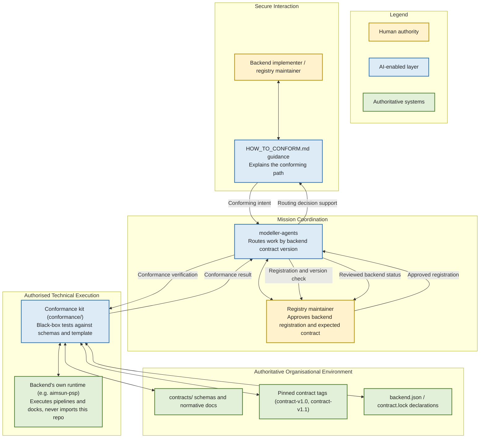

# Modeller Pipelines Contract Vision

## A backend-neutral contract surface for the modeller ecosystem's pipelines and docks

**Status:** Draft strategic reflection and discussion document
**Version:** 0.1, 25 July 2026
**Audience:** Backend implementers conforming to the contract (aimsun-psp today), modeller-agents maintainers, and anyone sponsoring the modeller ecosystem's contract-governance approach, for consideration
**Purpose:** Reflect honestly on what the modeller-pipelines contract surface is, what it currently proves, and what remains open, to support a decision on whether and how to invest further in it
**Upstream document:** None (no strategic brief precedes this repo; docs/INTEGRATION_PLAN.md is the closest existing design document and is treated here as prior working material, not a formal mandate)
**Downstream document:** A business-need-and-design-brief document, not yet written, would need to resolve open decision O1 (aimsun-psp's authoritative remote) and the registry-skew gap named below before scoping further work

---

## 1. Executive Summary

The modeller ecosystem already has real, working modelling capability: aimsun-psp implements pipelines and docks against Aimsun Next, and modeller-agents is being built to coordinate work across backends. What neither of those repos had, until this one, was a shared, versioned definition of what a pipeline, a step, a dock, and a result actually look like as data, independent of any one backend's runtime.

modeller-pipelines exists to supply exactly that: a set of JSON Schemas and normative prose defining pipeline.yml shape, the step run() interface, the CLI describe/run seam, backend.json registration, result.json semantics, and, as of contract-v1.1, a second first-class artefact type for QtDock in-process entry points. It ships as a black-box conformance kit and one copyable template pipeline, deliberately not as a library. Nothing in this repo is imported at runtime by any backend; that boundary (ADR-0001) is the repo's central design commitment, and it is the reason this vision treats the contract as a governance surface rather than a piece of shared infrastructure.

The repo's own maturity, honestly stated, is mixed. The contract content itself is concrete and current: two real commits, a clean working tree, six schemas and five normative documents on disk, and a fully implemented template pipeline. But the mechanism the whole design depends on to make the contract trustworthy at a distance, git tags pinning contract-v1.0 and contract-v1.1 for downstream consumers to fetch against, does not exist in this local clone. Downstream, the one real backend (aimsun-psp) has already moved to and conforms with contract-v1.1, while the registry side (modeller-agents) is still pinned to contract-v1.0 and marked status='planned', and the subtree meant to let modeller-agents check conformance offline is present but empty. This is not a hypothetical fragmentation risk; it is a live, currently measurable skew between what one backend declares and what the registry expects.

This document is offered as a reflection on that position, not as confirmation that the design is finished or that further investment is warranted without first closing the tagging and registration gaps.

> **A contract is only as trustworthy as the mechanism that lets someone else verify it without asking you.**

---

## 2. Strategic Opportunity

Aimsun-centric pipeline and dock code already exists and works: aimsun-psp runs real pipelines and docks against Aimsun Next, and it is documented as the contract's only real, first conforming backend. The modelling and delivery expertise behind that code is not in question. What was missing was a way for a second backend, or for modeller-agents acting as a coordinating layer, to know what a pipeline manifest, a step interface, or a result envelope should look like without reading aimsun-psp's own implementation and copying its assumptions wholesale.

The remaining opportunity is to connect this foundation more effectively with:

- a single, versioned schema authority that any backend can conform to without importing another backend's code;
- a registry (modeller-agents) that can validate a backend's declared contract version against the same pinned source the backend itself conformed to;
- a conformance kit that proves, mechanically, that a template pipeline and a set of schemas agree with each other, so drift between prose and schema is caught before a backend adopts either.

Today, this connection is only partly built. The schema authority exists and is versioned (contracts/VERSION reads 1.1), but the tag-and-fetch mechanism that would let a second repo pin to a specific contract version and verify it offline has not been exercised: `git tag -l` returns nothing in this clone, despite CONTRACT_VERSIONS.md, CHANGELOG.md, ADR-0002, and modeller-agents' own vendors.toml all referring to contract-v1.0 and contract-v1.1 as tags to pin against.

> Fragmentation risks (named concretely from the evidence gathered, not generically):
> - two authorities could quietly emerge for one schema, if a downstream skill (named in the repo's own INTEGRATION_PLAN.md as psp-pipeline-schema) maintains its own copy instead of pointing at contracts/schemas/pipeline.schema.json at a pinned tag;
> - the copyable template could become an accidentally-imported shared library if a backend imports minirunner.py instead of copying it, silently reintroducing the runtime coupling ADR-0001 exists to prevent;
> - a backend can move ahead of the registry's stated expectation without anyone noticing, which has already happened: aimsun-psp's backend.json and contract.lock both declare contract-v1.1, while modeller-agents/backends.toml and reference-packs/modeller-pipelines.toml are still pinned to contract-v1.0 and marked status='planned';
> - the offline verification path meant to catch exactly this kind of skew is unexecuted, because the modeller-agents/vendor/modeller-pipelines/ subtree directory exists but is empty.

These matter because the value of a shared contract is not the schemas themselves: it is the confidence that a backend's declared conformance and a registry's expectation of that backend actually agree, without either side having to trust the other's word for it.

---

## 3. Vision Statement

> **A pipeline, a step, and a dock should mean the same thing to every backend and to the registry that coordinates them, proven by a pinned, versioned contract that nothing needs to import to conform to.**

This vision does not require a shared runtime library, a single deployed pipeline engine, or centralising pipeline execution in one place. It requires only that every conforming backend point at the same pinned schema and prose, and that conformance be provable by running a black-box kit against a backend's own manifests and results, not by inspecting whether the backend imported the right module.

The target experience, for a backend implementer bringing an existing pipeline or dock system into the ecosystem: they would read docs/HOW_TO_CONFORM.md, copy the relevant template files as a starting point, run the conformance kit against their own pipeline.yml and result.json, and register a backend.json declaring the contract version they conform to, all without importing a single line of this repo's code into their runtime. For modeller-agents, the target experience is to fetch the pinned contract tag into its read-only vendor subtree and validate any backend's declared version against it before routing work to that backend.

| Today | With the contract surface fully operational |
|---|---|
| aimsun-psp conforms to contract-v1.1 by reading the schemas directly; no tag exists to pin that conformance against | A tagged, fetchable contract-v1.1 that aimsun-psp's contract.lock can be verified against independently |
| modeller-agents/backends.toml expects contract-v1.0 from aimsun-psp, one minor version behind its actual declaration | The registry's expected_contract field matches what the backend actually declares, checked automatically |
| The modeller-agents vendor/modeller-pipelines/ subtree is present but empty | The subtree holds the pinned contracts/ and conformance/ content, letting modeller-agents validate offline |
| No CI workflow in this repo runs the conformance kit against the template | A CI job proves, on every change, that the template and the schemas still agree |
| A second backend has no worked example beyond aimsun-psp to conform against | HOW_TO_CONFORM.md's six-step path is exercised by more than one real backend |

---

## 4. How the Contract Surface Supports the Organisation

modeller-pipelines is a governance and verification layer connecting independently-owned backends to a shared definition, not an independent decision-maker and not a runtime dependency of anything it describes.

### 4.1 Clarify the Objective
A backend implementer needs to know, precisely, what shape a pipeline.yml, a step's run() interface, and a result.json must take to be understood by the rest of the ecosystem. The five schemas and normative documents in contracts/ exist to answer that question without requiring a reading of aimsun-psp's own source.

### 4.2 Structure the Work
The template pipeline (trip_summary, with its four steps, minirunner.py, and result_builder.py) turns the abstract contract into a concrete, copyable starting point, so a new backend or a new pipeline within an existing backend has a working reference to adapt rather than a blank page.

### 4.3 Connect Existing Capabilities
The contract is designed to be conformed to, not adopted wholesale: aimsun-psp keeps its own pipeline and dock implementations and simply declares, in backend.json and contract.lock, which contract version it conforms to. This is reuse of an agreed shape, not reuse of code.

### 4.4 Support Authorised Execution
This section applies only loosely here: the contract surface does not itself execute anything. Its role in supporting execution is indirect, through the CLI describe/run seam it specifies, which lets a coordinating layer like modeller-agents understand what a backend's pipeline expects and produces without executing it directly.

### 4.5 Assist Analysis
Not yet applicable at this repo's current scope. The contract defines result.json semantics so that downstream consumers can distinguish a calculated result from surrounding metadata, but the analysis and interpretation of those results happens in the backends and in modeller-agents, not here.

### 4.6 Prepare Decision Evidence
The result-envelope schema and the conformance kit together are meant to give whoever is deciding whether to route work to a backend, most plausibly modeller-agents, a mechanical way to check that the backend's declared contract version and its actual manifests agree, rather than relying on the backend's own assertion.

### 4.7 Preserve Validated Learning
Contract changes are versioned deliberately: contract-v1.0 and contract-v1.1 are documented in CHANGELOG.md with what each added, and ADR-0002 commits to a single contract_version field rather than per-schema version sprawl. A schema or interface change becomes part of the accepted contract only through this versioned, documented path, not through silent edits.

---

## 5. Human-Led Principles and Authority Boundaries

The strongest schema and the most thorough conformance kit cannot substitute for the domain judgement of the people who build and operate each backend. This repo's role is to make it easier for backend implementers and the registry to agree on shape and version, not to decide what a backend should do or how it should model.

Human authority remains explicit:

- backend implementers decide how their pipelines and docks actually work internally; the contract only constrains the shape they expose;
- the repo's own ADR process (ADR-0001, ADR-0002, ADR-0003) is where contract-shape decisions are made and recorded, not by silent schema edits;
- modeller-agents' maintainers control what expected_contract and status values the registry declares for each backend, and are responsible for keeping that declaration current;
- only a tagged, released contract version becomes something a backend can conform to and a registry can pin against; unreleased schema drafts are not the contract.

A few commitments hold throughout:

- the contract prepares and defines; backend implementers and the registry decide how and whether to conform;
- this repo does not become a silent second authority over any backend's runtime: nothing here is imported at runtime by any backend (ADR-0001), and the backend that owns a pipeline or dock remains the authority for how it runs;
- a schema, a normative specification, a backend's declared conformance, and the registry's expectation of that conformance are kept visibly distinct, and the current skew between aimsun-psp's contract-v1.1 declaration and modeller-agents' contract-v1.0 expectation is exactly the kind of divergence this distinction is meant to surface, not hide;
- every significant contract change stays attributable to a commit, a version bump, and (once the tagging gap is closed) a tag, so a backend can always point to exactly what it conformed to.

The design is meant to fail safely: aimsun-psp does not import this repo's code, so if this repo were unavailable, aimsun-psp's pipelines would continue running exactly as before. The open gap is that the verification side of that safety, the tag-and-fetch mechanism and the modeller-agents vendor subtree, is not yet proven to work end to end, which is a real limitation on how much confidence the design's fail-safe claim currently deserves.

The operating model is federated by design. No single sponsoring service absorbs authority over backend implementations; modeller-pipelines defines a contract surface that backends conform to on their own terms, and modeller-agents is meant to consume that contract read-only, without owning the backends it routes to.

> **modeller-pipelines defines the shared contract; aimsun-psp and any future backend retain authority over their own implementations, and modeller-agents retains authority over its own routing decisions.**

### Operating Model (optional diagram)

---

## 6. Secure Foundation Principles

This repo carries no runtime, no service, and no execution surface of its own: it is schemas, prose, a conformance test kit, and a copyable template. Its security posture is therefore mostly about the integrity of the contract's distribution, not about protecting live infrastructure.

The governing model:

- the contract is distributed as pinned, tagged content; a backend or the registry should be able to fetch a specific version and know it will not change underneath them, once the tagging mechanism is actually in use;
- nothing in this repo is imported at runtime by any backend, so a defect or unavailability here cannot directly break a conforming backend's execution;
- each backend remains authoritative for its own access control, credentials, and runtime security; the contract does not touch or widen any backend's access;
- conformance results (what the kit found when run against a backend's manifests) should remain traceable to the exact contract version they were checked against.

Detailed distribution and CI mechanics are not yet decided in practice: no `.github/` CI workflow exists in this repo, so the keystone self-conformance job described in INTEGRATION_PLAN.md is checked-in intent rather than a running pipeline as far as this clone shows. That is a design-phase matter still to be closed, not a security posture to claim as current.

---

## 7. Strategic Value

Each value theme below answers directly to one of the fragmentation risks named in Section 2.

### A single schema authority instead of duplicated definitions
By publishing contracts/schemas/pipeline.schema.json and its companions as the one place a pipeline shape is defined, this repo answers the risk that a downstream skill or backend maintains its own competing copy. This value is only realised once downstream consumers actually point at the pinned schema rather than a local copy, which is not yet confirmed for every consumer named in the repo's own docs.

### A copy-don't-import boundary that keeps backends independent
The template's "COPY THIS FILE" headers, the roughly 200-line budget on minirunner.py, and ADR-0001's framework-by-stealth guard answer the risk of the template becoming an accidental shared library. This is proven by design intent and by aimsun-psp's actual conformance (it does not import this repo), though the CI grep for cross-repo imports that would enforce this mechanically is not confirmed to be running.

### A mechanical way to catch registry-backend version skew
The conformance kit and the versioned contract_version field answer the risk of a backend moving ahead of, or falling behind, what a registry expects. This value is currently unrealised in practice: the skew it is meant to catch (aimsun-psp at contract-v1.1, modeller-agents expecting contract-v1.0) already exists and has not yet been caught or corrected through this mechanism, because the vendor subtree that would let modeller-agents check it offline is empty.

### A durable, versioned history of contract decisions
The ADR sequence (ADR-0001 scaffold-not-framework, ADR-0002 single contract_version, ADR-0003 the QtDock artefact addition) and the CHANGELOG's documentation of contract-v1.0 and contract-v1.1 answer the risk of undocumented, informal drift in what the contract requires. This is well evidenced: the changelog content matches what is actually on disk.

---

## 8. Suggested First Step / Pilot

A contract surface earns confidence when a second real backend conforms to it independently, and when the tag-and-fetch mechanism it depends on is exercised at least once end to end, not only described.

Given the gaps found in this pass, the most bounded and immediately useful next step would not be a new pilot backend but closing the loop already promised by the existing design: cut the git tags contract-v1.0 and contract-v1.1 that CONTRACT_VERSIONS.md, CHANGELOG.md, and modeller-agents' own configuration already assume exist, populate the modeller-agents/vendor/modeller-pipelines/ subtree from the pinned tag, and update modeller-agents/backends.toml and reference-packs/modeller-pipelines.toml so their expected_contract value matches aimsun-psp's actual contract-v1.1 declaration. It would be deliberately bounded: no new schema content, no new backend, just making the existing, documented mechanism actually work for the one real backend that already depends on it.

### What success would demonstrate

Success would be demonstrated qualitatively, not by a promised figure: that modeller-agents can, offline, verify aimsun-psp's declared contract version against a locally vendored, pinned copy of the contract, without fetching anything live and without reading aimsun-psp's source. Candidate indicators to baseline during this step include whether the vendor subtree, once populated, actually matches the tagged content bit-for-bit, and whether the registry's expected_contract field, once corrected, stays in sync on the next contract version bump without manual intervention.

### A way to begin

> This document offers a vision and a suggested starting point, not a request for commitment.

If this direction resonates, a modest next step would be a short brief scoped to exactly the three items named above: cutting the tags, populating the vendor subtree, and correcting the registry's expected_contract value, each independently reviewable before any new schema content is proposed. Where the organisation takes it from there, including whether a second conforming backend is worth pursuing next, is entirely its own to decide.

---

## 9. Conclusion

This document does not claim modeller-pipelines is a finished or fully proven contract surface. It is a genuinely versioned, concretely documented schema and conformance kit, with one real conforming backend, but the mechanism meant to make that conformance verifiable at a distance, tagging and offline vendoring, has not yet been exercised, and a live version skew already exists between what that backend declares and what the registry expects.

What this is not: a shared runtime library, a decision-making system, or a substitute for the domain judgement of the people who build aimsun-psp or any future backend. What it is: a deliberately narrow, currently emerging governance surface intended to let independently-owned backends and a coordinating registry agree on the shape of a pipeline, a step, and a result, without importing each other's code.

> **A contract that no one has yet pinned, fetched, and checked end to end is a design, not yet a proof.**
