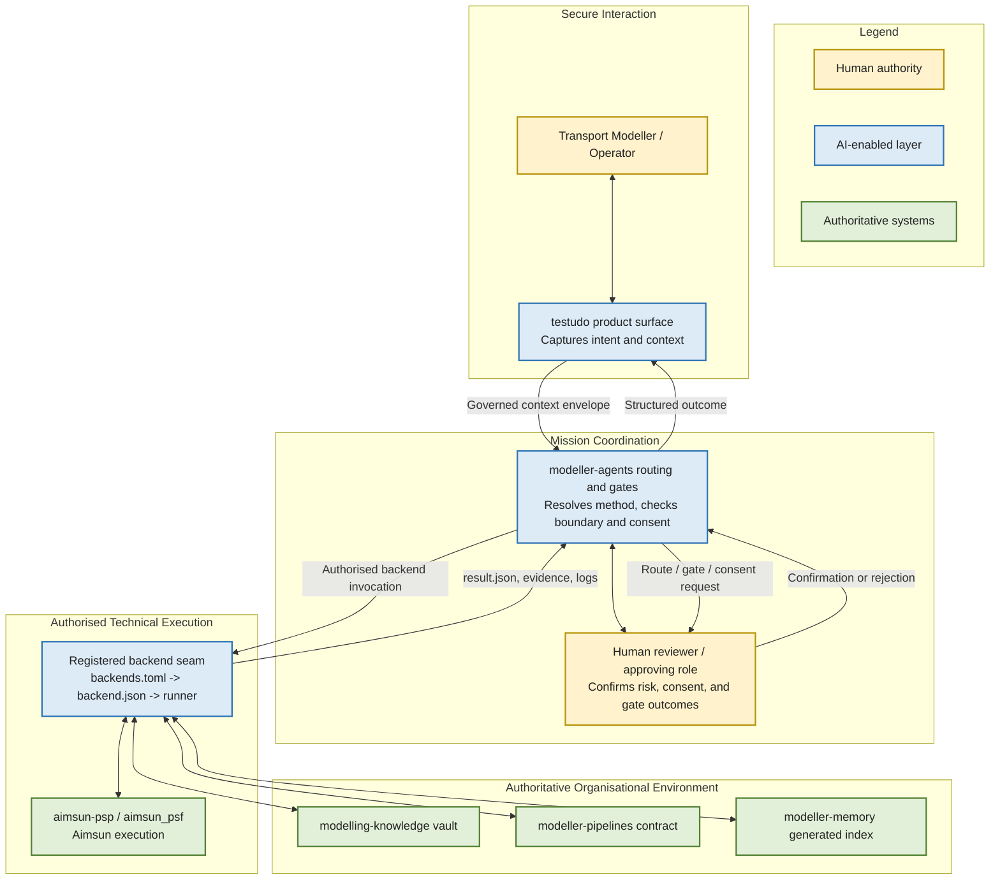

# modeller-agents Vision

## Composition and orchestration root for the modelling ecosystem

**Status:** Draft strategic reflection and discussion document
**Version:** 0.1, 25 July 2026
**Audience:** Ecosystem maintainers and sponsoring service, for consideration alongside the other five modelling-ecosystem vision documents
**Purpose:** State the direction and value of `modeller-agents` as the ecosystem's composition and orchestration root, honestly separating what is built and evidenced from what remains a target
**Upstream document:** `modelling-ecosystem/.docs/architecture.md` (ecosystem-level architecture authority)
**Downstream document:** None yet; a business-need-and-design brief would follow if a specific pilot on top of this root is chosen

---

## 1. Executive Summary

The modelling ecosystem already has real, working pieces: a transport-modelling product (`testudo`) that people use, a licensed simulation backend (`aimsun-psp`, with its embedded `aimsun_psf` services), a durable knowledge vault (`modelling-knowledge`), and a contract layer that defines what a pipeline result must look like (`modeller-pipelines`). What has been missing is a single, disciplined place where a request becomes a routed, governed, auditable piece of work rather than an ad hoc script or a one-off prompt.

`modeller-agents` is built to be that place: the composition and orchestration root. It does not model transport networks, does not store durable knowledge, and does not implement a backend. Today, what actually exists is a set of skills (routing, review, backend checks, pipeline checks, and a `workflow` skill) invoked one at a time, plus CLI tooling that validates artifact shape, including a check that a workflow-closing receipt names a `reviewer.actor_type: human`. That is a real, tested discipline, but it is a static, file-level check, not a live control-plane: there is no interactive surface today where a user watches a request route, steers which method or model handles it, or approves an in-flight step in real time. This document is honest about that gap rather than describing the skills-only reality as if it were already an orchestration runtime.

What remains a target, not yet built, is a genuine user-in-control control-plane in the spirit of a model/provider router: a surface where a user can see which method a governed request is being routed to, steer or override that routing choice, and approve or reject a step while it is in flight, rather than the routing and gating discipline living only inside skill invocations and post-hoc artifact validation. The complete, end-to-end proof that a request travels all the way from a governed context envelope through a registered backend to a validated result, with a real backend smoke passing, is a further, separate target on top of that control-plane.

The opportunity is not to build a new orchestration platform from scratch. It is to keep composing what already exists, honestly, one proven seam at a time, rather than let each repository grow its own bespoke routing and gating logic.

> **Orchestration should compose the ecosystem's existing capability under one deterministic, evidenced discipline, not add a second authority on top of it.**

---

## 2. Strategic Opportunity

The ecosystem already has domain capability and a working product surface. `testudo` gives transport modellers a working cockpit. `aimsun-psp` (with `aimsun_psf`) carries the concrete Aimsun pipelines and years of domain method. `modelling-knowledge` holds an accepted, durable vault. `modeller-pipelines` defines a backend-neutral contract for what a pipeline result must be. None of this needs to be rebuilt.

The remaining opportunity is to connect this foundation more effectively with:

- a routing layer that resolves a request to the correct repository, skill, and authorizing reference pack, instead of each caller guessing or hardcoding a path;
- a governance layer that checks source boundary, consent, and risk before a write or a backend call happens, instead of trusting the caller's own judgement;
- a workflow layer that requires artifact evidence, not a chat transcript, before a step is considered done.

Today, without that connecting layer, work can proceed on a partial understanding of who owns an outcome, and a subagent's claim of "done" can be accepted without anything that proves it.

> Fragmentation risks this repo's own documentation names directly:
> - a write, backend call, or knowledge promotion could target a repository that does not own the outcome, without a boundary check catching it;
> - a subagent can report a task as finished with no artifact that proves the required evidence, decisions, or verification exist;
> - a reference pack could quietly duplicate knowledge instead of pointing to the vault's authority, eroding the single-source-of-truth guarantee;
> - a backend could be treated as ready because it is registered, without a real invocation ever proving the contract seam works;
> - a user has no real-time way to see which method a request is routed to, steer that choice, or approve a step while it runs: today's discipline lives inside one-at-a-time skill invocations and post-hoc artifact checks, not a live control-plane.

These matter because the ecosystem's value is not only routing speed: it is keeping every repository's authority intact, so a decision or a result can always be traced back to the source that actually owns it.

---

## 3. Vision Statement

> **A governed request should reach the right method, in the right repository, under an explicit gate, and leave behind artifact evidence that proves what happened, every time, without a second authority forming above the repositories that already own their domains.**

This vision does not require centralizing modelling knowledge, memory, or backend implementation inside `modeller-agents`. It explicitly does not: those stay owned by `modelling-knowledge`, `modeller-memory`, and `aimsun-psp` respectively. What it requires is a routing and gating seam disciplined enough that every other repository can rely on it instead of reinventing it.

The target experience for an operator or an orchestrating agent: a context envelope states intent, target, risk, and consent; `route` resolves it to a bundle, a skill, and the reference packs that authorize that skill; a live control-plane lets the user see and steer that routing choice and approve or reject a step while it runs, with artifact evidence required before a step advances; and a backend is only called through a registered, contract-validated seam, never through an ad hoc import of another repository's implementation.

| Today | With `modeller-agents` at target maturity |
|---|---|
| Routing and gating exist as skills invoked one at a time, plus CLI tooling that validates artifact shape after the fact; there is no live surface where a user watches or steers a request in flight | A user-facing control-plane, in the spirit of a model/provider router, shows which method a request is routed to and lets the user steer that choice and approve or reject a step while it runs |
| A workflow-closing receipt is checked for `reviewer.actor_type: human` as a static field, after the work is already done | Approval is a live gate the user acts on during the workflow, not only a shape check applied to a receipt afterward |
| Routing logic and reference-pack knowledge are drafted and test-covered, but strict readiness still blocks release because packs are `draft` | Every bundle-selected reference pack is `active`, and strict readiness passes as the release gate |
| Backend registration exists in `backends.toml`, but `aimsun-psp` is `status = "planned"` with no proven smoke | A real backend smoke through the declared runner and result-schema validation has passed for the registered backend |
| `modeller-memory` and `modeller-pipelines` are vendored only as planned entries, unpinned, with schemas resolved through sibling fallback | Both vendors are synced and pinned to an immutable revision, and contract schemas resolve from the vendored copy, not the sibling checkout |
| The knowledge axis (domain packs referencing vault notes) is implemented and test-covered, but deactivated because the vault marks domains `draft`/`routable:false` | Knowledge-pack routing is live once the vault reactivates domain routability and decision 0010 is accepted at general scope |
| A subagent's "done" claim is, by design, not accepted as evidence from the artifact-shape check alone | The static check is proven and stays; a live control-plane adds real-time visibility on top of it, rather than replacing it |

---

## 4. How `modeller-agents` Supports the Organisation

`modeller-agents` is a connecting and gating layer between a governed request and the ecosystem's existing capability, not an independent decision-maker or a second knowledge authority.

### 4.1 Clarify the Objective
A context envelope makes intent, target repository, domains, risk, and consent state explicit before anything routes. `route` fails closed rather than guessing when a bundle, skill, or authorizing pack cannot be resolved.

### 4.2 Structure the Work
The `workflow` skill (`init` / `status` / `check` / `advance`) turns an objective into a sequence of steps, each owned by a named role (`orchestrator`, `planner`, `architect`, `executor`, `documenter`), each requiring specific artifacts before the next step opens. Today this is a skill invoked one step at a time with CLI tooling validating artifact shape after the fact, not a live surface a user watches or steers while a step runs; that live control-plane is a target, described in Section 3.

### 4.3 Connect Existing Capabilities
Routing selects reusable skills and reference packs instead of hardcoding repository knowledge into every caller. The backend seam calls a registered backend's declared runner rather than importing its implementation. The knowledge axis, once reactivated, references vault notes by ID rather than copying their content.

### 4.4 Support Authorised Execution
Medium and high risk work requires explicit consent before execution. Backend invocation goes through `backends.toml`, a manifest contract check, and result-schema validation, so what is running and what it depends on stays visible rather than implicit in a script.

### 4.5 Assist Analysis
`doctor` and `readiness` distinguish advisory local health from release-grade strict readiness, so an operator can see exactly which blockers (draft packs, unpinned vendors, sibling schema fallback, unproven backend smoke) separate the current state from a release-ready one, rather than a single pass/fail signal that hides the difference.

### 4.6 Prepare Decision Evidence
`workflow manifest` and `workflow close` produce a `RunManifest` that references workflow state, artifacts, gates, and subagent lane receipts by path and SHA-256 digest, so a completed run's evidence is addressable and checkable rather than asserted.

### 4.7 Preserve Validated Learning
The workflow's `memory` and `decisions` artifact families exist specifically so an agent's proposed observation becomes durable only through the classification and review path owned by `modeller-memory` and `modelling-knowledge`, never by `modeller-agents` writing directly into either authority.

---

## 5. Human-Led Principles and Authority Boundaries

Even a well-evidenced routing and gating layer cannot substitute for the domain judgement held by the repositories it composes. `modeller-agents`' role is to make invoking that judgement disciplined and traceable, not to replace it.

Human and repository authority stays explicit:

- the workflow's human-review gate accepts only a receipt with `reviewer.actor_type: human`; an AI-drafted artifact cannot satisfy a human gate by itself;
- `modelling-knowledge` remains the sole authority for accepted knowledge content; a knowledge pack here carries note IDs and routing metadata only, never note bodies, thresholds, or decision text, and copied-knowledge fields are rejected by validation;
- `modeller-memory` remains the authority for generated memory and `vault_doctor`; this repo never stores a memory index as authority;
- `aimsun-psp` remains the authority for backend implementation; this repo registers and invokes it through a declared contract seam, and forbids importing its implementation;
- repository-local agents stay in the repositories they operate on; only reusable, repository-agnostic method lives here, per `modelling-knowledge/decisions/0001-local-agents-central-skills.md`.

A few commitments hold throughout:

- routing prepares a proposal (repository, skill, authorizing packs); it does not execute medium or high risk work without consent;
- a bundle's routing key, a skill's declaration, and an authorizing reference pack must all agree before a route succeeds; there is no silent fallback;
- an artifact's evidence, decisions, and verification sections are checked for required content, not merely for existing, before a workflow gate opens;
- the system never becomes a silent second authority over another repository's domain: `AGENTS.md` states explicitly that moving a repository-local agent here, copying backend implementation, or storing a generated memory index as authority are all forbidden.

The framework is designed to fail closed rather than silently: when a route cannot resolve a bundle, skill, or authorizing pack, or when `execution_policy.requires_workflow` is set without an initialized, passing workflow run, `route` returns `ok: false` instead of proceeding on a best guess.

The operating model stays federated. `modeller-agents` composes and gates; it does not absorb the authority of the repositories whose knowledge, memory, or execution it routes to.

> **`modeller-agents` composes and gates the ecosystem's work; `modelling-knowledge`, `modeller-memory`, `aimsun-psp`, and `modeller-pipelines` retain authority within their own domains.**

### Operating Model

---

## 6. Secure Foundation Principles

The architecture keeps sensitive interaction inside `testudo` while routing and gating stay a deterministic, auditable seam, and demanding execution work runs inside the backend that already owns it.

The governing model:

- routing resolution and workflow gates run against the requesting envelope's own declared permissions and consent; a route does not widen access beyond what was declared;
- `modeller-agents` never imports another repository's implementation; it calls a declared runner through a registered contract seam;
- knowledge access stays a reference, never a copy: a knowledge pack carries note IDs and metadata, and validation rejects any field that would embed note content directly;
- every completed workflow run's artifacts and lane receipts are referenced by path and SHA-256 digest in the `RunManifest`, so evidence stays checkable rather than asserted.

Detailed backend security posture, service-boundary hardening, and any future background or scheduled execution mode remain design-phase matters. `AGENTS.md` currently forbids only what is listed above; broader security mechanisms should follow the strategic decision to expand scope, not precede it.

---

## 7. Strategic Value

Each value stream below answers directly to one of the fragmentation risks named in Section 2.

### Deterministic, auditable routing
Resolving a request through a bundle, a declared skill, and an authorizing reference pack, with `route` failing closed rather than guessing, answers the risk of work landing on a repository that does not own the outcome.

### Evidence-gated workflow
Requiring artifact-level evidence, decisions, and verification content before a step advances, and rejecting a subagent's "done" claim on its own, answers the risk of unproven work being accepted as complete.

### Knowledge as reference, not copy
Typed reference packs that carry only note IDs and routing metadata, with copied-knowledge fields rejected by validation, answers the risk of a pack silently duplicating and drifting from vault authority.

### Registered, contract-checked backend invocation
The backend seam's manifest contract check, consent gate, and result-schema validation, together with strict readiness's refusal to call a backend ready without a real smoke, answers the risk of a backend being trusted before its contract seam is actually proven.

### User-in-control routing and approval (target, not yet built)
A live control-plane, in the spirit of a model/provider router, where the user sees which method a request is routed to, can steer that choice, and approves or rejects a step while it runs, would answer the last risk named in Section 2: today's routing and gating discipline lives inside skill invocations and post-hoc artifact checks, so a user has no real-time way to watch or intervene in a request while it is in flight, only before it starts or after it ends.

---

## 8. Suggested First Step / Pilot

A vision for a composition root earns confidence by closing its own currently-documented readiness gaps on real, already-registered work, not by adding new scope. There are two distinct targets ahead, not one, and this section deliberately keeps them separate: closing the existing skills-only seam's readiness gaps, and building the live control-plane described in Section 3. Only the first is proposed as the immediate bounded starting point; the control-plane is a larger, separate direction this document raises for consideration, not a pilot scoped here.

Such a pilot would take the backend already registered in `backends.toml` (`aimsun-psp`) and carry it through the seam this vision describes: pin and sync the `modeller-memory` and `modeller-pipelines` vendors to immutable revisions, promote the bundle-referenced reference packs from `draft` to `active`, vendor the contract schemas so `doctor --strict` no longer reports sibling fallback, and run one real backend smoke through the declared runner that produces a schema-valid `result.json`. It would be deliberately bounded: one backend, the vendors and packs it already depends on, and `doctor --strict` exiting `0` as the definition of done, so the pilot proves the seam rather than expands it.

### What success would demonstrate

Success would show that the routing and gating discipline already built here, as skills and CLI checks, can carry a real request end to end through a registered backend and back, with every strict-readiness blocker code (`reference-pack-not-active`, `backend-not-active`, `backend-contract-unpinned`, `vendor-not-synced`, `vendor-not-pinned`, `schema-sibling-fallback`) cleared by evidence, not by relaxing the gate. Candidate baseline indicators: which blockers are open today, how long each remediation takes once scoped, and whether the resulting smoke evidence is stable across repeated runs. This pilot does not attempt to prove the live control-plane; that remains a separate, larger direction to consider once this seam is closed.

### A way to begin

> This document offers a vision and a suggested starting point, not a request for commitment.

If the direction resonates, a modest next step would be a short brief scoped to exactly the strict-readiness blocker list in `docs/readiness/STRICT_READINESS.md`: which vendor gets synced first, who confirms the `aimsun-psp` remote and pipeline id for the smoke, and what "clean" looks like when `doctor --strict --json` is re-run. A separate, later brief would need to scope the user-in-control control-plane on its own terms, since it is a materially larger piece of work than closing the existing readiness gaps. Where the organisation takes it from there, and at what pace, is entirely its own to decide.

---

## 9. Conclusion

This document does not claim `modeller-agents` is a finished orchestration platform, and it does not claim more than what is actually built. Routing, gating, and workflow discipline exist today as skills invoked one at a time, plus CLI tooling that validates artifact shape, including a real, tested check that a workflow-closing receipt names a human reviewer. That is genuine, evidenced discipline, not a proposal. Two things remain targets, not yet built: the complete Testudo-to-backend service loop with pinned vendors, active reference packs, and a proven backend smoke; and, separately, a live, user-in-control control-plane where a user watches a request route and approves or rejects a step while it runs, rather than the discipline living only inside skill invocations and post-hoc checks.

What this is not: a second authority over knowledge, memory, or backend implementation, or an autonomous system that executes without consent. What it is: a set of proven, evidence-gated skills and checks that let the ecosystem's existing repositories keep their own authority while a request still gets routed and gated, one closed blocker at a time, with real-time user control the next, separate direction to earn.

> **Composition without a second authority: route to what already exists, gate what matters, and prove it with evidence before calling it done.**
